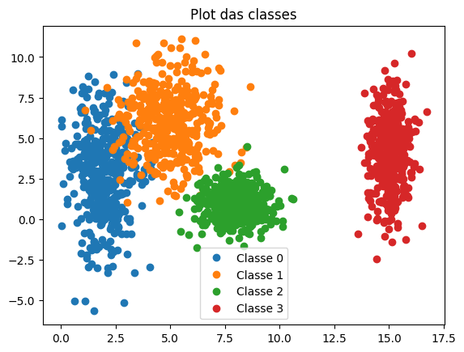
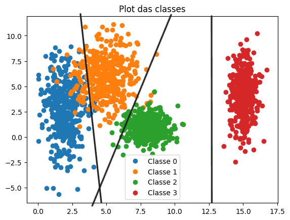
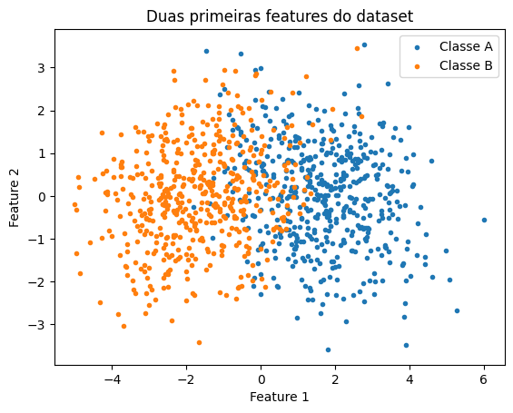
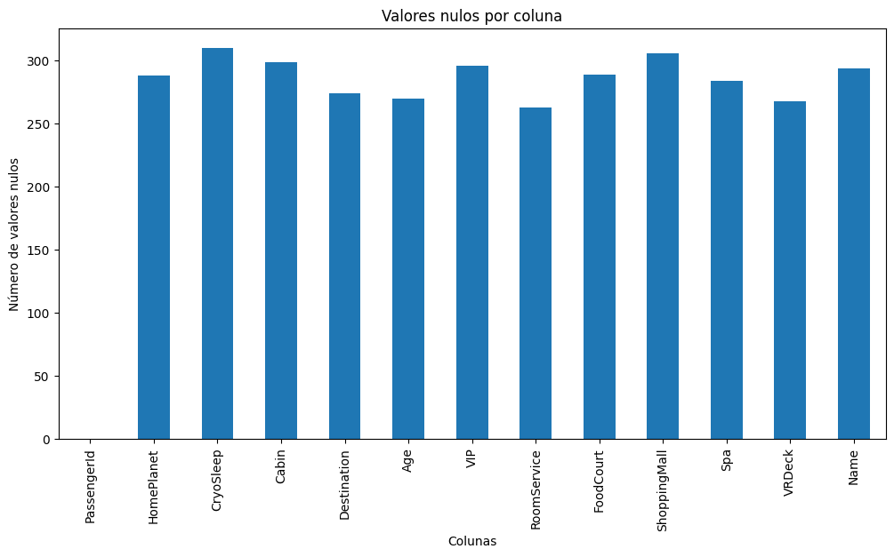
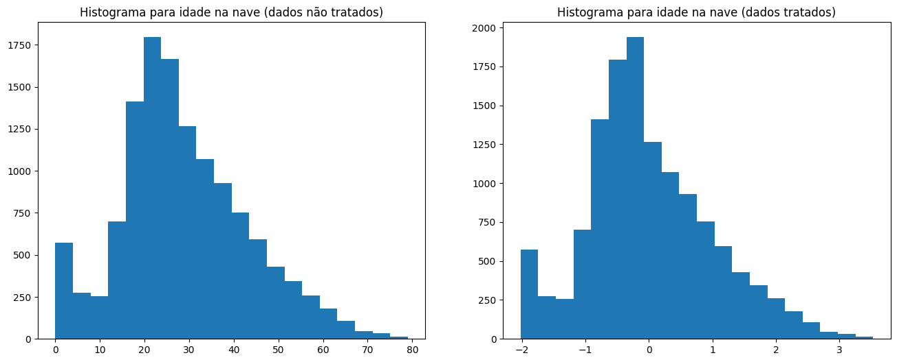
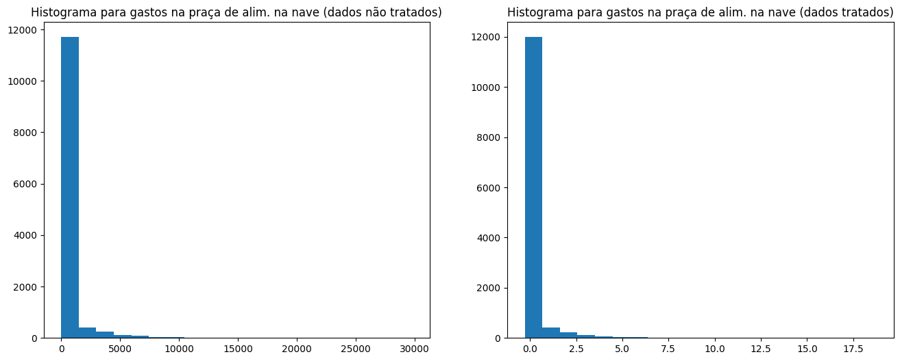
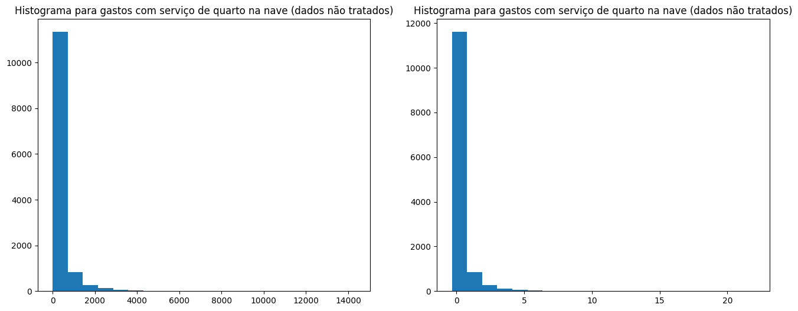

!!! abstract "Informações da entrega"
    📆 Deadline: 05/09/2025

    📖 O enunciado da atividade está disponível neste [link](https://insper.github.io/ann-dl/versions/2025.2/exercises/data).

## Exercício 1

Os dados foram gerados por um script em Python, apresentado a seguir:

=== "main.py"

    ``` py
    import matplotlib.pyplot as plt

    N = 400

    def main():
        class_0 = Data(mu=(2,  3), std=(.8,  2.5), n=N)
        class_1 = Data(mu=(5,  6), std=(1.2, 1.9), n=N)
        class_2 = Data(mu=(8,  1), std=(.9,   .9), n=N)
        class_3 = Data(mu=(15, 4), std=(.5,  2.0), n=N)

    x0, y0 = class_0.sample_initialize()
        x1, y1 = class_1.sample_initialize()
        x2, y2 = class_2.sample_initialize()
        x3, y3 = class_3.sample_initialize()

    plt.plot(x0, y0, "o", label="Classe 0")
        plt.plot(x1, y1, "o", label="Classe 1")
        plt.plot(x2, y2, "o", label="Classe 2")
        plt.plot(x3, y3, "o", label="Classe 3")

    plt.legend()

    plt.title("Plot das classes")

    plt.show()

    return 0

    if__name__ == "__main__":
        main()

    ```

=== "utils.py"

    ``` py
    import numpy as np

    class Data:
        def__init__(self, mu, std, n):
            self.mu_x, self.mu_y = mu
            self.std_x, self.std_y = std
            self.n = n

    def sample_initialize(self) -> tuple[np.ndarray, np.ndarray]:
            return np.random.normal(self.mu_x, self.std_x, self.n), np.random.normal(self.mu_y, self.std_y, self.n)

    class MultiDimensionData:
        def__init__(self, mu, cov, n):
            self.mu = mu
            self.cov = cov
            self.n = n

    def sample_initialize(self):
            return np.random.multivariate_normal(self.mu, self.cov, self.n)
    ```

A imagem a seguir mostra o *plot* dos pontos gerados em para cada uma das classes, diferenciadas pela cor.



Podemos observar que, principalmente as classes 0 e 1 possuem um grande *overlap*, que também é presente entre as classes 1 e 2, de maneira menos gritante. A classe 3 está completamente separada das outras três, quando observada visualmente.

Dessa forma, podemos concluir que as classes poderiam ser separadas com linhas, mas que provavelmente existiriam alguns conflitos quanto à classificação das classes 0 e 1 e das classes 1 e 2.

Abaixo segue uma representação visual de como as linhas poderiam separar as classes.



## Exercício 2

As amostras foram geradas pelo código apresentado abaixo:

=== "main.py"

    ``` py
    import matplotlib.pyplot as plt
    import numpy as np

    def main():
        mu_A = np.array([0, 0, 0, 0, 0])
        cov_A = np.array([[1.0, 0.8, 0.1, 0.0, 0.0],
                        [0.8, 1.0, 0.3, 0.0, 0.0],
                        [0.1, 0.3, 1.0, 0.5, 0.0],
                        [0.0, 0.0, 0.5, 1.0, 0.2],
                        [0.0, 0.0, 0.0, 0.2, 1.0]])

    mu_B = np.array([1.5, 1.5, 1.5, 1.5, 1.5])
        cov_B = np.array([[ 1.5, -0.7, 0.2, 0.0, 0.0],
                        [-0.7,  1.5, 0.4, 0.0, 0.0],
                        [ 0.2,  0.4, 1.5, 0.6, 0.0],
                        [ 0.0,  0.0, 0.6, 1.5, 0.3],
                        [ 0.0,  0.0, 0.0, 0.3, 1.5]])

    class_A = MultiDimensionData(mu=mu_A, cov=cov_A, n=500)
        class_B = MultiDimensionData(mu=mu_B, cov=cov_B, n=500)

    sample_A = class_A.sample_initialize()
        sample_B = class_B.sample_initialize()

    dataset = np.concatenate((sample_A, sample_B))

    return 0

    if__name__ == "__main__":
        main()
    ```

=== "utils.py"

    ``` py
    import numpy as np

    class Data:
        def__init__(self, mu, std, n):
            self.mu_x, self.mu_y = mu
            self.std_x, self.std_y = std
            self.n = n

    def sample_initialize(self) -> tuple[np.ndarray, np.ndarray]:
            return np.random.normal(self.mu_x, self.std_x, self.n), np.random.normal(self.mu_y, self.std_y, self.n)

    class MultiDimensionData:
        def__init__(self, mu, cov, n):
            self.mu = mu
            self.cov = cov
            self.n = n

    def sample_initialize(self):
            return np.random.multivariate_normal(self.mu, self.cov, self.n)
    ```

Em seguida, aplicou-se o conceito de **PCA** (**Principal Component Analysis**) para reduzir a dimensionalidade dos dados para **duas** dimensões (2D).

### **Passo-a-passo**

Após gerar as amostras (classes A e B), é necessário obter a matriz de covariância dos dados como um todo.

```py
mat = np.cov(dataset, rowvar=False)
```

Depois disso, precisamos obter os autovalores e os autovetores dessa matriz, sendo que os autovalores servirão para auxiliar na definição da importância das *features* e os autovetores são essenciais para que possamos obter um novo conjunto de amostras, agora apenas com as *features* selecionadas.

```py
# Obtenção dos autovalores e autovetores
eigenvalues, eigenvectors = np.linalg.eig(mat)

# Processo feito para ordenar a lista de autovetores e autovalores
## Obtém os índices que ordenariam o vetor e inverte a lista
idx = np.argsort(eigenvalues)[::-1]

## Ordena a lista de autovalores
eigenvalues = eigenvalues[idx]

## Ordena a lista de autovetores (colunas)
eigenvectors = eigenvectors[:, idx]

# Obtém os dois principais autovetores (para PC1 e PC2)
pcs = eigenvectors[:, :2] # matrix 5x2

# Centralizar o dataset original 
dataset_mu = dataset.mean(axis=0) # matriz 1000x5
dataset_cent = dataset - dataset_mu

# Obtenção do novo conjunto de dados
Z = dataset_cent @ pcs # (1000,5) x (5, 2)
```

Nota-se que foram realizadas algumas outras etapas antes de obtermos o novo conjunto de amostras, que foram realizadas para que esse conjunto estivesse centralizado.

Por fim, podemos *plotar* o gráfico com as duas *features* selecionadas e separá-las de acordo com as respectivas classes.



De acordo com a imagem, observa-se que os dados da classe B tendem mais a valores negativos, enquanto os da classes A tendem mais a valores positivos.

O problema surge pois existe uma grande quantidade de dados que são semelhantes, tornando o uso de modelos simples para classificação linear inadequados para classificar as classes. Seria necessário o uso de ferramentas mais robustas como um MLP, que possibilitam uma propagação de erro em camadas para que o modelo seja treinado de forma mais eficiente (*backpropagation*).

## Exercício 3

### **Objetivo do dataset**

O dataset apresenta como objetivo prever se um passageiro foi transportado para uma outra dimensão durante uma colisão da nave espacial Titanic com uma anomalia espaço-temporal. Para isso, são disponibilizados dados que foram recuperados dos registros pessoais dos passageiros do sistema da nave.

### **Descrição das *features***

Existem 14 features diferentes do dataset a ser analisado. Podemos separá-las em numéricas e em categóricas, como mostrado a seguir:

- **Numéricas**: `Age`, `RoomService`, `FoodCourt`, `ShoppingMall`, `Spa`, `VRDeck`;
- **Categóricas**: `HomePlanet`, `CryoSleep`, `Cabin`, `Destination`, `VIP`, `Name`, `Transported`.

### **Valores ausentes**

Podemos observar na imagem abaixo a quantidade de valores nulos por *feature*.



### **Pré-processamento dos dados**

Para cada tipo de feature, os dados faltantes foram tratados de maneiras diferentes:

- **categóricas (binárias e nominais)**: foi extraída a **moda** da coluna e os valores ausentes foram preenchidos por ela, visto que é uma estratégia simples, mas que contorna o problema de impossibilitar o *one-hot encoding*, por exemplo.
- **numéricas**: foi extraída a **mediana** e os valores ausentes preenchidos por ela, da mesma forma, é uma técnica simples que não exige muito tratamento, além de garantir roubstez a outliers, algo que o uso da média não possibilitaria.

Dessa forma, apesar de o dataset sofrer um leve desbalanceamento, os dados puderam ser mantidos em vez de remover linhas inteiras que contivessem valores nulos, mantendo a integridade da base de dados.

Além disso, a *feature* `Cabin` foi subdividida em 3 categorias menores: `CabinDeck`, `CabinNum` e `CabinSide`, como é descrito no site do [Kaggle](https://www.kaggle.com/competitions/spaceship-titanic/data?select=sample_submission.csv).

### **Fazendo *one-hot encoding* de *features* categóricas**

Para *features* como `HomePlanet`, `Destination`, `CabinDeck` e `CabinSide` (derivadas da *feature* `Cabin`), foi feito one-hot encoding para transformá-las em variáveis categóricas de ordem binária, sendo uma das etapas para possibilitar a implementação de uma rede neural cuja função de ativação é a tangente hiperbólica ($tanh(x)$).

### **Padronização dos dados (z-score)**

Em seguida, os dados foram tratados de forma que as features numéricas possuíssem média $0$ ($\mu = 0$) e desvio padrão $1$ ($\sigma = 0$). Essa é outra etapa para que seja possível realizar o treinamento da rede neural utilizando a função tanh(x) como função de ativação, visto que o domínio da função está definido no intervalo $[-1, 1]$.

### **Visualização dos resultados**

O primeiro histograma mostra a comparação de como era a distribuição das idades ANTES do tratamento dos dados e como ficou APÓS o tratamento.



Podemos observar que a quantidade de pessoas à bordo na faixa de 20 anos se mostra maior quando os dados não foram tratados. Após o tratamento, a faixa muda para 25 anos.

Em seguida, temos a comparação para duas variáveis semelhantes, que abordam os gastos na praça de alimentação da nave e com serviços de quarto, respectivamente.





Conseguimos, a partir dos gráficos, concluir que no caso dessas duas variáveis, não houverem mudanças significativas, uma vez que boa parte dos passageiros não gastou com esses dois serviços.
