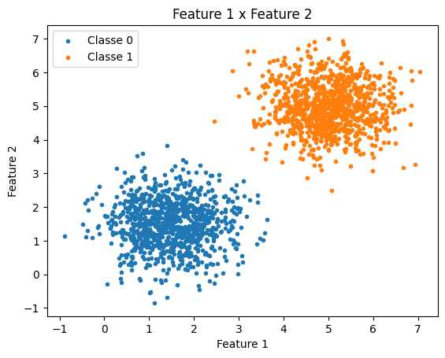
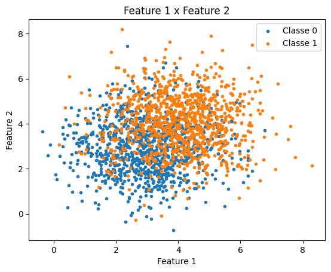
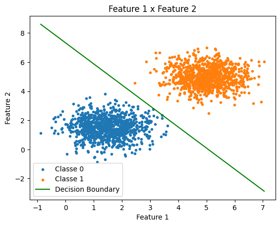
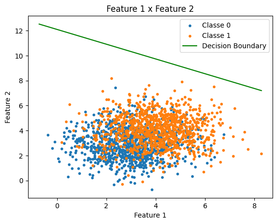

!!! abstract "Informações da entrega"
    📆 Deadline: 14/09/2025

    📖 O enunciado da atividade está disponível neste [link](https://insper.github.io/ann-dl/versions/2025.2/exercises/perceptron).


Para trabalhar nos exercícios, foi feita um arquivo de utilidades (`./utils/data.py`) com algumas funções comuns que foram utilizadas em outras situações também.

``` { .py title=data.py }

import numpy as np

class Data:
    def __init__(self, mu, std, n):
        self.mu_x, self.mu_y = mu
        self.std_x, self.std_y = std
        self.n = n

    def sample_initialize(self) -> tuple[np.ndarray, np.ndarray]:
        return np.random.normal(self.mu_x, self.std_x, self.n), np.random.normal(self.mu_y, self.std_y, self.n)

class MultiDimensionData:
    def __init__(self, mu: list, cov: list, n: int):
        self.mu = np.array(mu)
        self.cov = np.array(cov)
        self.n = n
    
    def sample_initialize(self):
        return np.random.multivariate_normal(self.mu, self.cov, self.n)
```

E importamos isso no arquivo de execução do código.

``` py

from utils import data
import numpy as np
import matplotlib.pyplot as plt
import seaborn as sns
import random

```

### Geração de dados

Foram geradas 2000 amostras de dados, utilizando uma distribuição normal (Gaussiana) multivariada, sendo que metade dos dados fazem parte de uma classe e a outra metade de outra (denominadas classes 0 e 1)

``` py

class_0 = data.MultiDimensionData(mu=[mu1, mu2],
                                  cov=[[cov11, cov12], [cov21, cov22]],
                                  n=N)

class_1 = data.MultiDimensionData(mu=[mu1, mu2],
                                  cov=[[cov11, cov12], [cov21, cov22]],
                                  n=N)

features = np.concatenate((class_0.sample_initialize(), class_1.sample_initialize()))

labels = np.concatenate((np.zeros(N, dtype=int), np.ones(N, dtype=int)))

shuffled_features, shuffled_labels = shuffle_sample(sample_array=features, labels_array=labels)
```

sendo `N = 1000`.

Foram utilizados diferentes valores para média e covariância para cada um dos exercícios, disponibilizados no link com o enunciado do exercício.

Também precisamos levar em conta que os dados foram embaralhados para evitar enviesamento durante o treinamento do modelo.

Para fins práticos, iremos referenciá-los aqui como linearmente separáveis (i - exercício 1) e sobrepostos (ii - exercício 2).

O plot dos gráficos para (i) e (ii) se encontra abaixo, respectivamente.

|                       |
|---------------------------------------------------------|
| *Figura 1 - Amostragem com dados linearmente separados* |

|                     |
|-----------------------------------------------|
| *Figura 2 - Amostragem com dados sobrepostos* |

### Implementação do *perceptron*

Foram definidas algumas funções que foram utilizadas para o **perceptron**.

=== "*Shuffle*"

``` py
def shuffle_sample(sample_array, labels_array):
    lista = list(zip(sample_array, labels_array))
    random.shuffle(lista)

    features, labels = zip(*lista)
    return np.array(features), np.array(labels)
```

=== "Métricas"

``` py
def confusion_matrix(y_true, y_pred):
    y_true = np.array(y_true)
    y_pred = np.array(y_pred)

    VP = np.sum((y_true == 1) & (y_pred == 1))  # verdadeiros positivos
    VN = np.sum((y_true == 0) & (y_pred == 0))  # verdadeiros negativos
    FP = np.sum((y_true == 0) & (y_pred == 1))  # falsos positivos
    FN = np.sum((y_true == 1) & (y_pred == 0))  # falsos negativos

    return np.array([[VN, FP],
                     [FN, VP]])

def accuracy(y_true, y_pred):
    y_true = np.array(y_true)
    y_pred = np.array(y_pred)
    return np.mean(y_true == y_pred)
```

=== "Processamento"

``` py
def forward(x, y, activation, n_epochs, eta=.01):
    W = np.array([[0, 0]])
    b = 0

    acc_array = []
    total_epochs = 0

    for i in range(n_epochs):
        print(f"[epoch {i+1}] Starting...")

        total_epochs = i+1
        y_pred_vec = []
        updated = 0

        for j in range(x.shape[0]):
            z = np.dot(W, x[j].T) + b

            y_pred = activation(z)

            y_pred_vec.append(y_pred)

            error = y[j] - y_pred
            
            if error != 0:
                updated += 1
                W = W + eta * error * x[j]
                b = b + eta * error
        
        acc = accuracy(y, y_pred_vec)
        acc_array.append(acc)

        print(f"- Accuracy: {acc}")

        if not updated:
            print(f"- No updates detected...")

            break

    print(f"Training finished after {total_epochs} epochs.")
    return W, b, y_pred_vec
```

No exercício 1, como esperado, o modelo converge após algumas épocas (menos que 100), visto que os dados são linearmente separáveis.

O gráfico abaixo mostra a linha de separação entre as classes, calculada com base nos pesos e no bias obtidos pelo *forward pass* após o treinamento.

|     |
|----------------------------------------------------|
| *Figura 3 - Linha de separação para a amostra (i)* |

Em seguida, calculamos para os dados sobrepostos, em que o esperado era que o modelo não fosse capaz de convergir, visto que precisamos de um modelo mais complexo (por exemplo, MLP ou SVM) para separar os dados de forma mais correta.
Ao rodar o código, foi obtida uma acurácia de aproximadamente $60\%$, e a linha de decisão pode ser vista na imagem abaixo.

|                  |
|-----------------------------------------------------|
| *Figura 4 - Linha de separação para a amostra (ii)* |