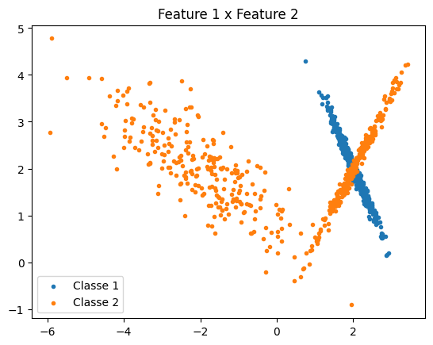
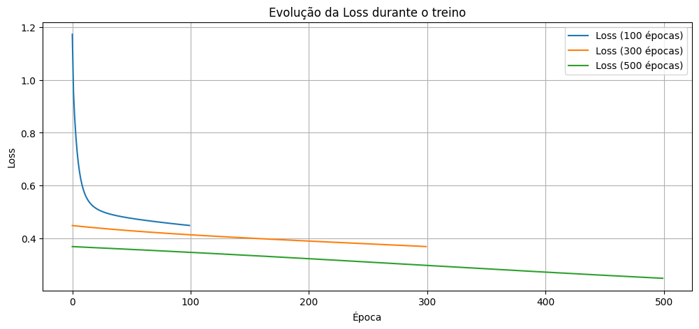
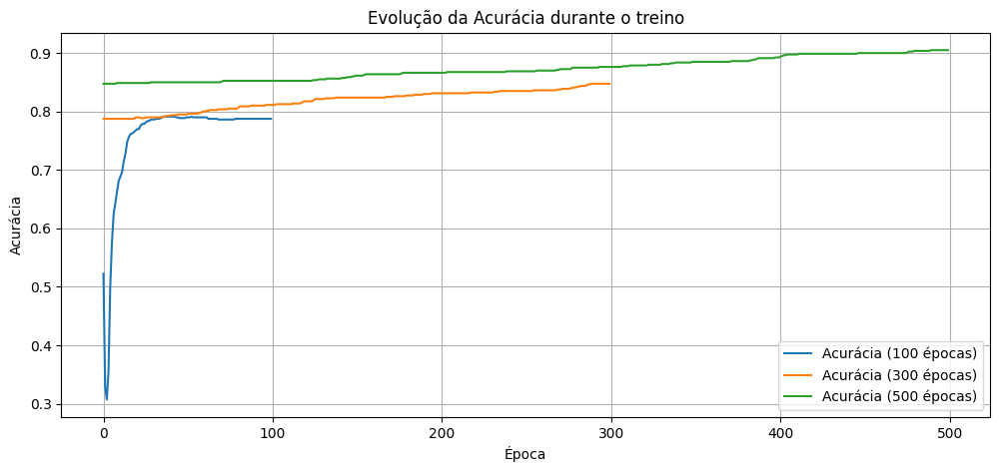
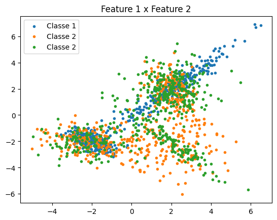

!!! abstract "Informações da entrega"
    📆 Deadline: 21/09/2025

    📖 O enunciado da atividade está disponível neste [link](https://insper.github.io/ann-dl/versions/2025.2/exercises/mlp).

Para essa atividade, uma sequência de passos foi seguida a fim de garantir a execução correta do MLP:

1. Inicialização da amostra;

   - Amostragem ($x$): $n_{features} \times n_{amostras}$
   - Rótulos ($y$): $n_{outputs} \times n_{amostras}$
2. Definição de hiperparâmetros para o treinamento do modelo;

   - Pesos da camada oculta: ($W^{(1)}$) $n_{features} \times n_{neurônios}$
   - Bias da camada oculta($b^{(1)}$): $n_{neurônios} \times n_{amostras}$
   - Pesos da camada de saída ($W^{(2)}$): $n_{neurônios} \times n_{saídas}$
   - Bias da camada de saída ($b^{(2)}$): $n_{saídas} \times n_{amostras}$
   - Função de ativação: $f(x)$

   - Derivada da função de ativação: $f'(x)$
   - Função de perda: $\mathcal{L}$
3. Treino;
4. Teste.

### Exercício 1: Cálculo manual das etapas para um Multi-Layer Perceptron (MLP)

- Passo 1

=== "Inicialização da amostra"

    ``{ .py title=main.py }     samples_1 = np.array([[0.5, -0.2]]).T   # n_features X n_samples      labels_1 = np.array([[1]])              # n_outputs X n_samples    ``

- Passo 2

=== "Definição de hiperparâmetros"

    ``` { .py title=main.py }
    W1_1 = np.array([[0.3, 0.2], [-0.1, 0.4]])  # n_features X n_neurons
    b1_1 = np.array([[0.1], [-0.2]])            # n_neurons X n_samples

    W2_1 = np.array([[0.5], [-0.3]])            # n_neurons X n_outputs
    b2_1 = np.array([[0.2]])                    # n_outputs X n_samples

    activation_function_1 = lambda x: (np.exp(2 * x) - 1) / (np.exp(2 * x) + 1)
    activation_function_1_derivative = lambda x: 1 - (activation_function_1(x)**2)

    loss_function_1 = lambda y, y_pred: 0.5 * (y - y_pred)**2
    loss_function_1_derivative = lambda y, y_pred: y - y_pred
    ```

Foi utilizada, conforme o enunciado do [exercício](https://insper.github.io/ann-dl/versions/2025.2/exercises/mlp/#exercise-1-manual-calculation-of-mlp-steps), a função de perda *Mean Squared Error* (MSE) e a função de ativação $tanh(x)$.

- Passo 3

=== "Treinamento"

    ``` py title="main.py"
    kwargs_1 = {
                "input": samples_1,
                "output": labels_1,
                "W_hidden": W1_1,
                "b_hidden": b1_1,
                "W_output": W2_1,
                "b_output": b2_1,
                "eta": eta_1,
                "hidden_activation": activation_function_1,
                "hidden_activation_d": activation_function_1_derivative,
                "output_activation": activation_function_1,
                "output_activation_d": activation_function_1_derivative,
                "loss_function": loss_function_1,
                "loss_function_d": loss_function_1_derivative
            }

    mlp_data_train_1 = data.MLP(**kwargs_1)

    z1, h1, z2, y_pred = mlp_data_train_1.forward()

    loss = mlp_data_train_1.loss_calculation(labels_1, y_pred)

    dW1_1, db1_1, dW2_1, db2_1 = mlp_data_train_1.backpropagation(z1, h1, z2, y_pred)

    W_hidden, b_hidden, W_output, b_output = mlp_data_train_1.update_weights(dW1_1, db1_1, dW2_1, db2_1)
    ```

=== "Classe"

    ``` py title="models.py"
    class MLP:

        def__init__(self, **kwargs):
            self.input  = kwargs.get("input")
            self.output = kwargs.get("output")
            self.W_hidden = kwargs.get("W_hidden")
            self.b_hidden = kwargs.get("b_hidden")
            self.W_output = kwargs.get("W_output")
            self.b_output = kwargs.get("b_output")
            self.eta = kwargs.get("eta", 0.001)

            # Hidden layer
            self.hidden_activation   = kwargs.get("hidden_activation")
            self.hidden_activation_d = kwargs.get("hidden_activation_d")

            # Output layer (opcional)
            self.output_activation   = kwargs.get("output_activation", None)
            self.output_activation_d = kwargs.get("output_activation_d", None)

            # Loss
            self.loss_function   = kwargs.get("loss_function")
            self.loss_function_d = kwargs.get("loss_function_d")

        def forward(self):
            # Hidden layer
            # z1_pre: (n_neurons X n_samples);
            # W1: (n_neurons X n_feat); input: (n_feat X n_samples); b1: (n_neurons X n_samples)
            z1_pre = self.W_hidden.T @ self.input + self.b_hidden
            z1_act = self.hidden_activation(z1_pre)

            # Output layer
            # z2_pre: (n_outputs X n_samples);
            # W2: (n_outputs X n_neurons); z1_act: (n_neurons X n_samples); b2: (n_outputs X n_samples)
            z2_pre = self.W_output.T @ z1_act + self.b_output

            if self.output_activation:
                z2_act = self.output_activation(z2_pre)
            else:
                z2_act = z2_pre

            return z1_pre, z1_act, z2_pre, z2_act

        def loss_calculation(self, true_label, predicted_label):
            return self.loss_function(true_label, predicted_label)

        def backpropagation(self, z1_pre, z1_act, z2_pre, z2_act):
            # formato n_output X n_samples
            output_error = self.loss_function_d(self.output, z2_act)

            if self.output_activation_d:
                output_error *= self.output_activation_d(z2_pre)

            # formato n_neurons X n_samples
            hidden_error = (self.W_output @ output_error) * self.hidden_activation_d(z1_pre)

            # Gradientes
            W_output_gradient = z1_act @ output_error.T
            b_output_gradient = np.sum(output_error, axis=1, keepdims=True)
            W_hidden_gradient = self.input @ hidden_error.T
            b_hidden_gradient = np.sum(hidden_error, axis=1, keepdims=True)

            return W_hidden_gradient, b_hidden_gradient, W_output_gradient, b_output_gradient

        def update_weights(self, W_hidden_gradient, b_hidden_gradient,
                        W_output_gradient, b_output_gradient):
            self.W_hidden -= self.eta * W_hidden_gradient
            self.b_hidden -= self.eta * b_hidden_gradient
            self.W_output -= self.eta * W_output_gradient
            self.b_output -= self.eta * b_output_gradient
            return self.W_hidden, self.b_hidden, self.W_output, self.b_output
    ```

Os resultados do *backward pass* para as camadas oculta (1) e de saída (2) foram:

$\frac{\partial \mathcal{L}}{\partial W^{(1)}} \approx \begin{bmatrix} 0.26179727 & 0.22385243 \cr -0.08471891 & 0.39045903 \end{bmatrix}$

$\frac{\partial \mathcal{L}}{\partial b^{(1)}} \approx \begin{bmatrix} 0.02359454  \cr -0.15229515 \end{bmatrix}$

$\frac{\partial \mathcal{L}}{\partial W^{(2)}} \approx \begin{bmatrix} 0.45670643 \cr -0.27075481 \end{bmatrix}$

$\frac{\partial \mathcal{L}}{\partial b^{(2)}} \approx 0.03577581$

### Exercício 2: Classificação binária com dados sintéticos

- Passo 1

=== "Inicialização da amostra"

    ``` py title="main.py"
    N_FEATURES_2 = 2
    N_OUTPUT_2 = 1
    N_NEURONS_2 = 10
    SAMPLE_SIZE_2 = 1000
    TRAIN_SIZE = .8

    samples_1_2, samples_labels_1_2 = make_classification(n_samples=SAMPLE_SIZE_2 // 2,
                                                    n_classes=1,
                                                    n_clusters_per_class=1,
                                                    n_features=N_FEATURES_2,
                                                    n_informative=2,
                                                    n_redundant=0,
                                                    random_state=21,
                                                    class_sep=2.0)

    samples_2_2, samples_labels_2_2 = make_classification(n_samples=SAMPLE_SIZE_2 // 2,
                                                    n_classes=1,
                                                    n_clusters_per_class=2,
                                                    n_features=N_FEATURES_2,
                                                    n_informative=2,
                                                    n_redundant=0,
                                                    random_state=42,
                                                    class_sep=2.0)

    samples_labels_1_2[:] = 0
    samples_labels_2_2[:] = 1

    samples_total_2 = np.concatenate((samples_1_2, samples_2_2))
    samples_total_labels_2 = np.concatenate((samples_labels_1_2, samples_labels_2_2))

    shuffled_samples_total_2, shuffled_samples_total_labels_2 = data.shuffle_sample(sample_array=samples_total_2, labels_array=samples_total_labels_2)
    ```

O tamanho da amostragem é de 1000, com 2 classes, 2 *features* e 16 neurônios para a camada oculta. Como é um problema de classificação **binária**, o número de *outputs* é de 1 (0 ou 1).

A imagem (_ref_) ilustra graficamente a relação entre as *features*.

|            |
| :--------------------------------------: |
| Figura 1: Amostragem para o exercício 2 |

- Passo 2

=== "Definição de hiperparâmetros"

    ``` py title="main.py"
    val = (6 / (N_FEATURES_2 + N_OUTPUT_2))**.5

    W1_2 = np.random.uniform(-val, val, size=(N_FEATURES_2, N_NEURONS_2))
    W2_2 = np.random.uniform(-val, val,  size=(N_NEURONS_2, N_OUTPUT_2))

    b1_2 = np.zeros((N_NEURONS_2, 1)) # n_neurons X n_sample (train)
    b2_2 = np.zeros((N_OUTPUT_2, 1))

    train_sample_2, test_sample_2, train_sample_labels_2, test_sample_labels_2 = data.train_test_split(shuffled_samples_total_2, shuffled_samples_total_labels_2, TRAIN_SIZE)

    train_sample_2 = train_sample_2.T
    test_sample_2 = test_sample_2.T

    mu  = np.mean(train_sample_2, axis=1, keepdims=True)
    std = np.std(train_sample_2, axis=1, keepdims=True) + 1e-8

    train_sample_norm_2 = (train_sample_2 - mu) / std
    test_sample_norm_2  = (test_sample_2  - mu) / std

    sigmoid = lambda x: 1 / (1 + np.exp(-x))
    sigmoid_d = lambda x: sigmoid(x) * (1 - sigmoid(x))

    eps = 1e-8
    bce = lambda y, y_pred: -(y * np.log(y_pred + eps) + (1 - y) * np.log(1 - y_pred + eps))
    bce_d = lambda y, y_pred: (y_pred - y) / ((y_pred + eps) * (1 - y_pred + eps))
    ```

Aqui, inicializamos os pesos com o método de Xavier/Glorot. No exercício, é utilizada a inicialização uniforme de Xavier, definida pela equação $2.1$.

$$
x = \sqrt{\frac{6}{n_{inputs} + n_{outputs}}} \quad \text{(2.1)}
$$

Foi utilizada a função de ativação sigmoide, pois os valores estão normalizados, juntamente à função de perda *Binary Cross-Entropy* (BCE), por se tratar de uma classificação binária.

- Passo 3

=== "Treinamento"

    ``` py title="train.py"
    kwargs_2 = {"input": train_sample_norm_2,
            "output": train_sample_labels_2,
            "W_hidden": W1_2,
            "b_hidden": b1_2,
            "W_output": W2_2,
            "b_output": b2_2,
            "eta": .001,
            "hidden_activation": sigmoid,
            "hidden_activation_d": sigmoid_d,
            "output_activation": sigmoid,
            "output_activation_d": sigmoid_d,
            "loss_function": bce,
            "loss_function_d": bce_d}

    mlp_object_train_2 = data.MLP(**kwargs_2)

    epoch_losses = {100: [], 300: [], 500: []}
    epoch_accuracy = {}

    for n_epochs, losses in epoch_losses.items():
        epoch_accuracy[n_epochs] = []

    for epoch in range(n_epochs):
            z1_pre, z1_activation, z2_pre, z2_activation = mlp_object_train_2.forward()

    loss = mlp_object_train_2.loss_calculation(train_sample_labels_2, z2_activation)
            losses.append(np.mean(loss))

    y_pred = (z2_activation > 0.5).astype(int)
            acc = np.mean(y_pred == train_sample_labels_2)
            epoch_accuracy[n_epochs].append(acc)

    W_hidden_gradient, b_hidden_gradient, W_output_gradient, b_output_gradient = mlp_object_train_2.backpropagation(z1_pre, z1_activation, z2_pre, z2_activation)

    W_hidden, b_hidden, W_output, b_output = mlp_object_train_2.update_weights(W_hidden_gradient, b_hidden_gradient, W_output_gradient, b_output_gradient)
    ```

O treinamento foi realizado utilizando 100, 300 e 500 épocas, e foi avaliada de acordo com as perdas ao longo do treinamento, assim como a acurácia obtida.

|              |
| :-------------------------------------: |
| Figura 2: Perda ao longo do treinamento |

|              |
| :-----------------------------------------: |
| Figura 3: Acurácia ao longo do treinamento |

- Passo 4

=== "Teste"

    ``` py title="main.py"
    kwargs_test_2 = {
                    "input": test_sample_norm_2,
                    "output": test_sample_labels_2,
                    "W_hidden": W_hidden,
                    "b_hidden": b_hidden,
                    "W_output": W_output,
                    "b_output": b_output,
                    "eta": .001,
                    "hidden_activation": sigmoid,
                    "hidden_activation_d": sigmoid_d,
                    "output_activation": sigmoid,
                    "output_activation_d": sigmoid_d,
                    "loss_function": bce,
                    "loss_function_d": bce_d
                }

    mlp_object_test_2 = data.MLP(**kwargs_test_2)

    z1_test_2, h1_test_2, z2_test_2, y_pred_test_2 = mlp_object_test_2.forward()

    loss_test_2 = mlp_object_test_2 = data.MLP(**kwargs_test_2).loss_calculation(test_sample_labels_2, y_pred_test_2)

    THRESHOLD = .5

    y_pred = (y_pred_test_2 > THRESHOLD).astype(int)
    acc_test = np.mean(y_pred == test_sample_labels_2)
    ```

Após o treinamento, foi obtida uma acurácia de $90.50\%$, como esperado de acordo com o gráfico ilustrado na figura 3.

### Exercício 3: Classificação multi-classe com dados sintéticos

- Passo 1

=== "Inicialização da amostra"

    ``` py title="main.py"
    SAMPLE_SIZE_3           = 1500
    N_FEATURES_3            = 4
    N_INFORMATIVE_3         = 4
    N_REDUNDANT_3           = 0
    random_state            = {"classe 0": 21,
                        "classe 1": 42,
                        "classe 2": 84}
    n_cluters_per_class     = {"classe 0": 2,
                        "classe 1": 3,
                        "classe 2": 4}
    CLASS_SEP_3             = 2.0
    N_CLASSES_3             = 3
    N_NEURONS_3             = 128

    samples_0_3, samples_labels_0_3 = make_classification(n_samples=SAMPLE_SIZE_3 // 3,
                                                    n_classes=1,
                                                    n_clusters_per_class=n_cluters_per_class["classe 0"],
                                                    n_features=N_FEATURES_3,
                                                    n_informative=N_INFORMATIVE_3,
                                                    n_redundant=N_REDUNDANT_3,
                                                    random_state=random_state["classe 0"],
                                                    class_sep=CLASS_SEP_3)

    samples_1_3, samples_labels_1_3 = make_classification(n_samples=SAMPLE_SIZE_3 // 3,
                                                    n_classes=1,
                                                    n_clusters_per_class=n_cluters_per_class["classe 1"],
                                                    n_features=N_FEATURES_3,
                                                    n_informative=N_INFORMATIVE_3,
                                                    n_redundant=N_REDUNDANT_3,
                                                    random_state=random_state["classe 1"],
                                                    class_sep=CLASS_SEP_3)

    samples_2_3, samples_labels_2_3 = make_classification(n_samples=SAMPLE_SIZE_3 // 3,
                                                    n_classes=1,
                                                    n_clusters_per_class=n_cluters_per_class["classe 2"],
                                                    n_features=N_FEATURES_3,
                                                    n_informative=N_INFORMATIVE_3,
                                                    n_redundant=N_REDUNDANT_3,
                                                    random_state=random_state["classe 2"],
                                                    class_sep=CLASS_SEP_3)

    samples_labels_0_3[:] = 0
    samples_labels_1_3[:] = 1
    samples_labels_2_3[:] = 2

    samples_total_3 = np.concatenate((samples_0_3, samples_1_3, samples_2_3))
    samples_total_labels_3 = np.concatenate((samples_labels_0_3, samples_labels_1_3, samples_labels_2_3))

    shuffled_samples_total_3, shuffled_samples_total_labels_3 = data.shuffle_sample(sample_array=samples_total_3, labels_array=samples_total_labels_3)
    ```

A figura 4 mostra um gráfico da distribuição das amostras em relação à 2 features.

|            |
| :--------------------------------------: |
| Figura 4: Amostragem para o exercício 3 |

- Passo 2

=== "Definição dos hiperparâmetros"

    ``` py title="main.py"
    val = (6 / (N_FEATURES_3 + N_CLASSES_3))**.5

    W1_3 = np.random.uniform(-val, val, size=(N_FEATURES_3, N_NEURONS_3))
    W2_3 = np.random.uniform(-val, val, size=(N_NEURONS_3, N_CLASSES_3))

    b1_3 = np.zeros((N_NEURONS_3, 1))
    b2_3 = np.zeros((N_CLASSES_3, 1))

    train_sample_3, test_sample_3, train_sample_labels_3, test_sample_labels_3 = data.train_test_split(shuffled_samples_total_3, shuffled_samples_total_labels_3)

    train_sample_3 = train_sample_3.T
    test_sample_3 = test_sample_3.T

    mu  = np.mean(train_sample_3, axis=1, keepdims=True)
    std = np.std(train_sample_3, axis=1, keepdims=True) + 1e-8

    train_sample_norm_3 = (train_sample_3 - mu) / std
    test_sample_norm_3  = (test_sample_3  - mu) / std

    tanh = lambda x: (np.exp(2*x) - 1) / (np.exp(2*x) + 1)
    tanh_d = lambda x: 1 - tanh(x)**2

    def softmax(z):
        exp_z = np.exp(z - np.max(z, axis=0, keepdims=True))
        return exp_z / np.sum(exp_z, axis=0, keepdims=True)

    def cce(y, y_pred, eps=1e-8):
        N = y.shape[1]
        return -np.sum(y * np.log(y_pred + eps)) / N

    def cce_d(y, y_pred):
        N = y.shape[1]
        return (y_pred - y) / N
    ```

Nesse exercício, utilizamos a função de ativação $tanh(x)$, visto que a amostra foi normalizada, e $softmax(x)$, que é adequada para problemas de classificação multi-classe. Para avaliação, foi utilizada a função de perda *Categorical Cross-Entropy*.

- Passo 3

=== "Treinamento"

    ``` py title="main.py"
    THRESHOLD_3 = .5
    activation_array = [tanh, softmax]
    activation_d_array = [tanh_d, None]

    kwargs_train_3 = {
                    "input": train_sample_norm_3,
                    "output": train_labels_onehot_3,
                    "W_hidden": W1_3,
                    "b_hidden": b1_3,
                    "W_output": W2_3,
                    "b_output": b2_3,
                    "eta": .001,
                    "hidden_activation": activation_array[0],
                    "hidden_activation_d": activation_d_array[0],
                    "output_activation": activation_array[1],
                    "output_activation_d": activation_d_array[1],
                    "loss_function": cce,
                    "loss_function_d": cce_d
                    }

    mlp_object_train_3 = data.MLP(**kwargs_train_3)

    epoch_losses_3 = {100: [], 300: [], 500: []}
    epoch_accuracy_3 = {}

    batch_size = 32
    N = train_sample_norm_3.shape[1]

    for n_epochs, losses in epoch_losses_3.items():
        epoch_accuracy_3[n_epochs] = []

    for epoch in range(n_epochs):
            epoch_correct = 0
            epoch_count = 0
            epoch_loss_accum = 0.0

    for start in range(0, N, batch_size):
                end = min(start + batch_size, N)

    sample_batch = train_sample_norm_3[:, start:end]
                labels_batch = train_labels_onehot_3[:, start:end]

    mlp_object_train_3.input = sample_batch
                mlp_object_train_3.output = labels_batch

    z1_pre_train_3, z1_activation_train_3, z2_pre_train_3, z2_activation_train_3 = mlp_object_train_3.forward(
                )

    # ==============================================================
                # Armazenando a loss para plotar no gráfico depois
                loss = mlp_object_train_3.loss_calculation(labels_batch,
                                                        z2_activation_train_3)
                if np.ndim(loss) > 0:
                    loss = np.mean(loss)

    B = end - start
                epoch_loss_accum += loss * B
                # ==============================================================

    # ==============================================================
                # Armazenando a acurácia do modelo para plotar no gráfico depois
                preds_idx = np.argmax(z2_activation_train_3, axis=0)
                true_idx = np.argmax(labels_batch, axis=0)
                epoch_correct += np.sum(preds_idx == true_idx)
                epoch_count += B
                # ==============================================================

    # ==============================================================
                # Backpropagation
                dW1_train_3, db1_train_3, dW2_train_3, db2_train_3 = mlp_object_train_3.backpropagation(
                    z1_pre_train_3, z1_activation_train_3, z2_pre_train_3,
                    z2_activation_train_3)
                # ==============================================================

    # ==============================================================
                # Ajustando os parâmetros para o próximo batch
                W_hidden_train_3, b_hidden_train_3, W_output_train_3, b_output_train_3 = mlp_object_train_3.update_weights(
                    dW1_train_3, db1_train_3, dW2_train_3, db2_train_3)
                # ==============================================================

    epoch_loss = epoch_loss_accum / epoch_count
            epoch_acc = epoch_correct / epoch_count

    losses.append(epoch_loss)
            epoch_accuracy_3[n_epochs].append(epoch_acc)
    ```

Dessa vez, fazemos o treinamento em *batches* como tentativa de aumentar a qualidade do modelo.

- Passo 4

=== "Teste"

    ``` py
    kwargs_test_3 = {
                    "input": test_sample_norm_3, 
                    "output": test_sample_labels_3, 
                    "W_hidden": W_hidden_train_3, 
                    "b_hidden": b_hidden_train_3, 
                    "W_output": W_output_train_3, 
                    "b_output": b_output_train_3, 
                    "eta": .001, 
                    "hidden_activation": activation_array[0], 
                    "hidden_activation_d": activation_d_array[0], 
                    "output_activation": activation_array[1],
                    "output_activation_d": activation_d_array[1], 
                    "loss_function": cce,
                    "loss_function_d": cce_d
                }

    mlp_object_test_3 = data.MLP(**kwargs_test_3)

    def accuracy_from_preds(z2_act, y_true):
        # z2_act: (M, N), y_true: one-hot (M, N) ou indices (N,)
        y_pred_idx = np.argmax(z2_act, axis=0)
        if y_true.ndim == 2:
            y_true_idx = np.argmax(y_true, axis=0)
        else:
            y_true_idx = y_true
        return np.mean(y_pred_idx == y_true_idx), y_pred_idx, y_true_idx

    z1, h1, z2, y_pred_test = mlp_object_test_3.forward()
    acc_test, preds_idx, true_idx = accuracy_from_preds(y_pred_test, test_sample_labels_3) 
    ```

A acurácia do modelo na amostragem de teste foi de $83.58\%$.
