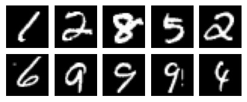
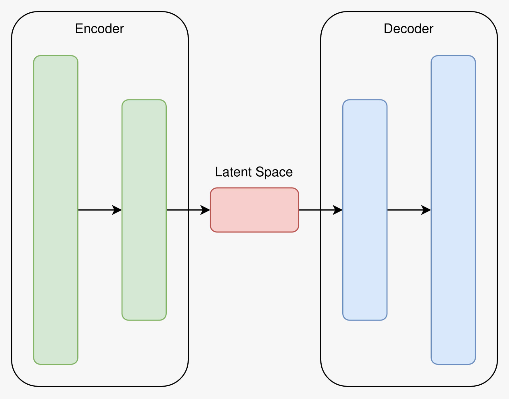
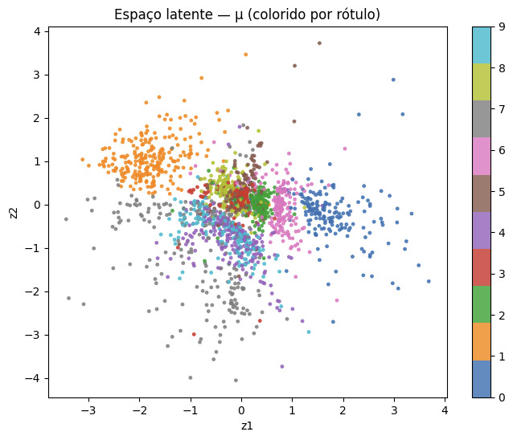
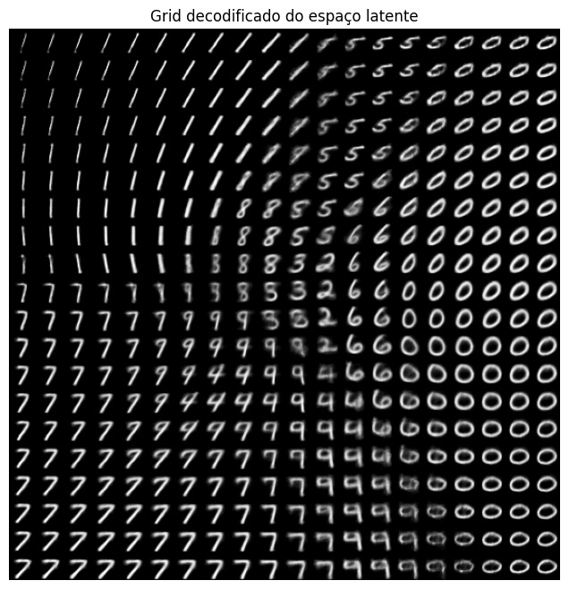

!!! abstract "Informações da entrega"
    📆 Deadline: 26/10/2025

    📖 O enunciado da atividade está disponível neste [link](https://insper.github.io/ann-dl/versions/2025.2/exercises/vae).

Para importar as bibliotecas necessárias, incluir as linhas a seguir no código.

=== "Importando bibliotecas"

    ``` { .py title=main.py }
    import torch
    import torch.nn as nn
    from torchvision import datasets
    from torchvision.transforms import transforms
    from torch.utils.data import DataLoader
    from utils import mlp
    import numpy as np
    import matplotlib.pyplot as plt
    from mpl_toolkits.axes_grid1 import ImageGrid
    from tqdm import tqdm
    ```

A atividade foi feita utilizando uma seed para reprodutibilidade em outros ambientes. Também é importante selecionar o dispositivo no qual o programa será executado.

=== "Semente manual"

    ``` py title="main.py"
    gen = torch.manual_seed(42)
    ```

=== "Seleção do dispositivo"

    ``` py title="main.py"
    device = torch.device('cuda' if torch.cuda.is_available() else 'cpu')
    print(f'-> Using device: {device}')
    ```

## Preparação do *dataset*

Os dados utilizados foram carregados do *dataset* MNIST, utilizando o framework do `PyTorch`.

Juntamente ao carregamento dos dados, foi feita a divisão em datasets para treinamento e teste, contendo $60000$ e $10000$ imagens cada um, respectivamente.

=== "Dataset de treinamento"

    ``` py title="train.py"
    transform = transforms.Compose([transforms.ToTensor()])

    train_dataset = datasets.MNIST(
        root=DATA_PATH,
        train=True,
        transform=transform,
        download=True
    )
    ```

=== "Dataset de testes"

    ``` py title="test.py"
    transform = transforms.Compose([transforms.ToTensor()])

    test_dataset = datasets.MNIST(
        root=DATA_PATH,
        train=False,
        transform=transform,
        download=True
    )
    ```

Sendo `DATA_PATH` o caminho onde os dados serão salvos em sua máquina.

O argumento `transform` foi utilizado para fazer com que os dados fossem representados em forma de **tensores**, ao invés de imagens no formato `PIL`.

Após o carregamento dos datasets, precisamos fazer com que seja possível fazer iterações sobre os itens dentro deles. Isso é feito utilizando a classe `DataLoader` do módulo `torch.utils.data` do PyTorch.

=== "Carregando dataset de treinamento"

    ``` py title="train.py"
    train_loader = DataLoader(
        dataset=train_dataset,
        batch_size=BATCH_SIZE,
        shuffle=True
    )
    ```

=== "Carregando dataset de testes"

    ``` py title="test.py"

    test_loader = DataLoader(
        dataset=test_dataset,
        batch_size=BATCH_SIZE,
        shuffle=False
    )
    ```

Visualizando $10$ amostras do dataset, temos:

|  |
| :--: |
| Figura 1: Visualização dos dados |

## Implementação do modelo

A arquitetura do modelo utilizado pode ser representada pela Figura 2.

|  |
| :--: |
| Figura 2: Visualização dos dados |

=== "Arquitetura do modelo"

    ``` py title="models.py"
    class VAE(nn.Module):
        def __init__(self, device, input_dim=784, hidden_dim=400, latent_dim=10):
            super(VAE, self).__init__()
            self.device = device
            self.encoder = nn.Sequential(
                OrderedDict([
                    ('fc1', nn.Linear(input_dim, hidden_dim)),
                    ('relu1', nn.ReLU()),
                    ('fc2', nn.Linear(hidden_dim, latent_dim))
                ])
            )

            self.mu_layer = nn.Linear(latent_dim, 2)
            self.logvar_layer = nn.Linear(latent_dim, 2)

            self.decoder = nn.Sequential(
                OrderedDict([
                    ('fc1', nn.Linear(2, latent_dim)),
                    ('relu1', nn.ReLU()),
                    ('fc2', nn.Linear(latent_dim, hidden_dim)),
                    ('relu3', nn.ReLU()),
                    ('fc3', nn.Linear(hidden_dim, input_dim)),
                    ('output', nn.Sigmoid())
                ])
            )

        def encode(self, x):
            x = self.encoder(x)
            mu, logvar = self.mu_layer(x), self.logvar_layer(x)
            return mu, logvar
        
        def reparameterize(self, mu, logvar):
            std = torch.exp(0.5 * logvar)
            eps = torch.randn_like(std).to(self.device)
            return mu + eps * std
        
        def decode(self, z):
            return self.decoder(z)
        
        def forward(self, x):
            mu, logvar = self.encode(x)
            z = self.reparameterize(mu, logvar)
            x_pred = self.decode(z)
            return x_pred, mu, logvar
    ```

Nessa arquitetura, temos as seguintes características:

- ***Encoder***: a entrada é um tensor de tamanho $784$, ou seja, uma imagem do dataset "achatada" ($28 \times 28$). As informações da imagem são então transferidas para uma camada oculta. Podemos representar a passagem pelo encoder como: $784 \rightarrow 400 \rightarrow 10 \rightarrow 2$;

- **Reparametrização**: é adicionada uma camada para que o truque seja feito corretamente. Essa camada possui 2 dimensões;

- ***Decoder***: a entrada é a saída do espaço latente, ou seja, um tensor com 2 dimensões. Essa entrada faz o caminho contrário do *encoder*, ou seja, $2 \rightarrow 10 \rightarrow 400 \rightarrow 784$. A saída é uma imagem reconstruída com base no espaço latente.

## Treinamento

Para treinar o modelo, utilizaremos $100$ épocas e o otimizador Adam, *Binary Cross-Entropy* e *Kullback Leibler Divergence* para função de perda, em adição a um *batch size* de $128$.

=== "Variáveis para treinamento"

    ``` py title="train.py"
    vae = models.VAE(device).to(device)
    optimizer = torch.optim.Adam(vae.parameters(), lr=1e-3)

    EPOCHS = 100
    batch_size = 128
    ```

=== "Função para treinamento"

    ``` py title="train.py"
    def train(model, device, train_loader, optimizer, epochs, checkpoint_path=None):
        model.train()
        for epoch in range(epochs):
            train_loss = 0.0

            progress_bar = tqdm(train_loader, desc=f"Epoch {epoch+1}/{epochs}", leave=False)

            for _, (data, _) in enumerate(progress_bar):
                batch_size = data.size(0)
                data = data.to(device).view(batch_size, -1)

                optimizer.zero_grad()
                
                x_pred, mu, logvar = model(data)
                loss = loss_function(data, x_pred, mu, logvar)
                loss.backward()
                optimizer.step()

                train_loss += loss.item() * batch_size

                # atualiza descrição da barra
                progress_bar.set_postfix(loss=loss.item())

            avg_loss = train_loss / len(train_loader.dataset)

            
            if checkpoint_path:
                if (epoch + 1) % 10 == 0:
                    checkpoint_path = f"{CHECKPOINTS_PATH}/vae_epoch_{epoch + 1}.pt"

                    checkpoint = {
                        'epoch': epoch + 1,
                        'model_state_dict': model.state_dict(),
                        'optimizer_state_dict': optimizer.state_dict(),
                        'loss': avg_loss,
                    }

                    torch.save(checkpoint, checkpoint_path)

            print(f"Epoch {epoch + 1}/{epochs} - Average loss: {avg_loss:.6f}")

        return train_loss
    ```

A função calcula a perda acumulada ao final de cada época e soma em uma variável `train_loss`, que será retornada após o treinamento ser concluído. Além disso, foram implementadas duas funcionalidades extras:

- Visualização gráfica através de uma barra de progresso;

- Salvamento periódico em arquivos `.pt`, denominados *checkpoints*, que possuem informações sobre o modelo em um determinado momento. Por padrão, no código, o período foi de $10$ épocas, ou seja, a cada período é gerado um arquivo contendo as informações do modelo que podem ser recuperadas caso o treinamento seja interrompido.

Podemos então, realizar o treinamento.

``` py title="train.py"
total_loss = train(vae, device, train_loader, optimizer, epochs=100, checkpoint_path=CHECKPOINTS_PATH)
```

## Avaliação do modelo

Para avaliarmos o modelo, usamos 

## Visualização do espaço latente

Abaixo, temos visualizações do espaço latente, tanto em relação à distribuição quanto às imagens dentro desse espaço.

|  |
| :--: |
| Figura 3: Espaço latente (distribuição) |

|  |
| :--: |
| Figura 4: Espaço latente (imagens) |