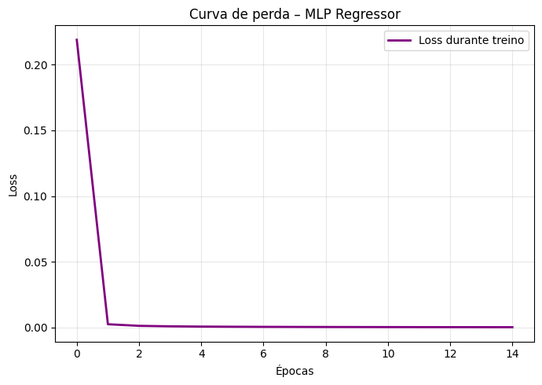
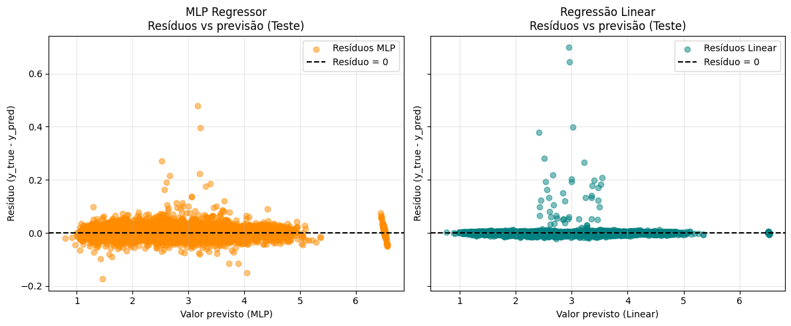

# Projeto 02 — Regressão de Preços de Combustíveis (2004-2021)

## Estudantes
- Pedro De Lucca S. C. Ferro
- Carlos Eduardo P. Yamada

## Código Fonte
- Notebook de exploração e modelagem: `src/proj2_regression/main.ipynb`

## Resumo

Este projeto modela a variação do **preço médio de revenda de combustíveis no Brasil entre 2004 e 2021** utilizando a base pública da ANP (Agência Nacional do Petróleo, Gás Natural e Biocombustíveis). Foram comparadas duas abordagens de regressão:

- **MLPRegressor** (Rede Neural) com arquitetura (64, 32) neurônios + early stopping
- **Regressão Linear** como baseline

Surpreendentemente, a **Regressão Linear** apresentou desempenho superior com **R² = 1.0000** (perfeito), **RMSE = 0.0097** e **MAE = 0.0021**, superando a MLP (R² = 0.9999, RMSE = 0.0146, MAE = 0.0098). Este resultado indica que a relação entre as variáveis é essencialmente **linear**, tornando modelos mais simples mais apropriados para este problema.

## Fonte de Dados

- **Arquivo**: `code/projects/02-Regression/data/2004-2021.tsv`
- **Origem**: Série histórica da ANP com preços de combustíveis por estado, município e produto. Acesse [aqui](https://www.kaggle.com/datasets/matheusfreitag/gas-prices-in-brazil/data)
- **Período**: Janeiro/2004 a Dezembro/2021

## Dataset

### Características do Conjunto de Dados
- **Dimensão original**: 120.823 linhas × 18 colunas
- **Dimensão após limpeza**: 111.875 linhas (remoção de duplicatas e valores inválidos -99999.000)
- **Variável alvo**: `PREÇO MÉDIO REVENDA` (R$)

### Atributos Principais

**Temporais:**
- `DATA INICIAL`, `DATA FINAL`: período de coleta dos preços
- Variáveis derivadas: `ANO`, `MES`, `ANO/MES` (criadas para análise temporal)

**Geográficos:**
- `REGIÃO`: 5 regiões do Brasil
- `ESTADO`: 27 unidades federativas

**Produto e Medição:**
- `PRODUTO`: Gasolina Comum, Gasolina Aditivada, Etanol Hidratado, Diesel, Diesel S10, GLP
- `UNIDADE DE MEDIDA`: R\$/litro ou R\$/13kg (para GLP)

**Métricas de Preço (Revenda):**
- `PREÇO MÉDIO REVENDA` (target)
- `PREÇO MÍNIMO REVENDA`, `PREÇO MÁXIMO REVENDA`
- `MARGEM MÉDIA REVENDA`
- `COEF DE VARIAÇÃO REVENDA`
- `DESVIO PADRÃO REVENDA`

**Métricas de Distribuição:**
- `PREÇO MÉDIO DISTRIBUIÇÃO`
- `PREÇO MÍNIMO DISTRIBUIÇÃO`, `PREÇO MÁXIMO DISTRIBUIÇÃO`
- `COEF DE VARIAÇÃO DISTRIBUIÇÃO`
- `DESVIO PADRÃO DISTRIBUIÇÃO`

**Amostragem:**
- `NÚMERO DE POSTOS PESQUISADOS`: quantidade de estabelecimentos na coleta

### Análise Exploratória


*Figura 1: Evolução temporal dos preços médios de revenda por tipo de combustível (2004-2021). Observa-se tendência de crescimento consistente com picos em 2015 e 2021.*


*Figura 2: Comparação da evolução dos preços da gasolina comum entre estados do Nordeste. Nota-se variação significativa entre estados ao longo do período.*

## Metodologia

### 1. Pré-processamento e Limpeza

#### Conversão de Tipos
```python
# Conversão de datas
for col in ["DATA INICIAL", "DATA FINAL"]:
    df[col] = pd.to_datetime(df[col], errors="coerce")

# Conversão de colunas numéricas que vieram como texto
numeric_object_cols = [c for c in obj_cols if c not in categorical_true]
for col in numeric_object_cols:
    df[col] = pd.to_numeric(df[col], errors="coerce")
```

#### Remoção de Duplicatas e Valores Inválidos
```python
df = df.drop_duplicates()
df = df.replace(-99999.000, np.nan)
df = df.dropna()
```

- Removidas duplicatas
- Removidos valores inválidos codificados como -99999.000
- Removidas linhas com valores ausentes (NaN)
- **Dataset final**: 111.875 registros

#### Tratamento de Valores Ausentes
- **Colunas numéricas**: imputação com mediana
- **Colunas categóricas**: imputação com moda
- Método robusto a outliers (mediana preferível à média)

#### Detecção e Tratamento de Outliers
```python
# Método IQR (Interquartile Range)
q1 = df[col].quantile(0.25)
q3 = df[col].quantile(0.75)
iqr = q3 - q1
lower_bound = q1 - 1.5 * iqr
upper_bound = q3 + 1.5 * iqr

# Clipping ao invés de remoção (preserva tamanho do dataset)
df[col] = df[col].clip(lower_bound, upper_bound)
```

**Justificativa**: Clipping preserva informações extremas mas realistas (ex: picos históricos de preço) enquanto remove anomalias claras.

### 2. Engenharia de Features

#### Features Temporais
- `ANO`: extraído de `DATA FINAL`
- `MES`: extraído de `DATA FINAL`
- `ANO/MES`: timestamp mensal para análises de série temporal

#### Encoding de Variáveis Categóricas
```python
# One-hot encoding com drop_first=True para evitar multicolinearidade
categorical_cols = ["REGIÃO", "ESTADO", "PRODUTO", "UNIDADE DE MEDIDA"]
df_model = pd.get_dummies(df_model, columns=categorical_cols, drop_first=True)
```

**Resultado**: expansão de 4 colunas categóricas para múltiplas colunas binárias

#### Normalização (Z-score)
```python
# Padronização: (x - μ) / σ
X[num_cols] = (X[num_cols] - X[num_cols].mean()) / X[num_cols].std(ddof=0)
```

**Justificativa**: essencial para convergência da MLP e comparabilidade de pesos entre features.

### 3. Divisão do Dataset

```python
X_train, X_test, y_train, y_test = train_test_split(
    X, y,
    test_size=0.2,      # 80/20 split
    random_state=42,    # reprodutibilidade
    shuffle=True        # embaralhamento para evitar viés temporal
)
```

- **Treino**: 89.500 amostras (80%)
- **Teste**: 22.375 amostras (20%)

### 4. Modelos Implementados

#### MLPRegressor (Rede Neural)

**Arquitetura:**

- Camada de entrada: features após encoding
- Camada oculta 1: 64 neurônios + ReLU
- Camada oculta 2: 32 neurônios + ReLU
- Camada de saída: 1 neurônio (regressão)

**Hiperparâmetros:**
```python
MLPRegressor(
    hidden_layer_sizes=(64, 32),
    activation="relu",
    solver="adam",           # otimizador adaptativo
    alpha=1e-3,             # regularização L2
    learning_rate="adaptive", # ajuste dinâmico de learning rate
    max_iter=300,
    early_stopping=True,     
    n_iter_no_change=10,   
    random_state=42
)
```

**Convergência**: parada antecipada após **15 iterações** (de 300 máximas)


*Figura 3: Curva de perda (loss) durante o treinamento da MLP. Convergência rápida com estabilização após ~10 épocas.*

#### Regressão Linear (Baseline)

```python
LinearRegression()
```

Modelo linear sem regularização, servindo como baseline para comparação.

### 5. Métricas de Avaliação

| Métrica | Descrição | Interpretação |
|---------|-----------|---------------|
| **MSE** | Mean Squared Error | Erro quadrático médio |
| **RMSE** | Root Mean Squared Error | Erro médio em R$ (penaliza grandes erros) |
| **MAE** | Mean Absolute Error | Erro médio absoluto em R$ |
| **R²** | Coeficiente de Determinação | % da variância explicada (0 a 1) |

## Resultados

### Métricas Comparativas

| Modelo              | MSE (train) | MSE (teste) | RMSE (train) | RMSE (teste) | MAE (train) | MAE (teste) | R² (train) | R² (teste) |
| ------------------- | ----------- | ----------- | ------------ | ------------ | ----------- | ----------- | ---------- | ---------- |
| **MLPRegressor**    | 0.0002      | 0.0002      | 0.0141       | 0.0146       | 0.0096      | 0.0098      | **0.9999** | **0.9999** |
| **Regressão Linear**| 0.0001      | 0.0001      | 0.0093       | 0.0097       | 0.0021      | 0.0021      | **1.0000** | **1.0000** |

**Observações:**

- A **Regressão Linear** surpreendentemente superou a MLP em todas as métricas
- **R² da Regressão Linear**: 1.0000 (perfeito) vs 0.9999 da MLP
- **RMSE da Regressão Linear**: 34% menor (0.0097 vs 0.0146)
- **MAE da Regressão Linear**: 79% menor (0.0021 vs 0.0098)
- Ausência de overfitting: métricas de treino e teste praticamente idênticas em ambos os modelos
- O número reduzido de iterações (15) da MLP sugere rápida convergência
- **Conclusão principal**: A relação nos dados é essencialmente **linear**, tornando a Regressão Linear o modelo mais apropriado
### Análise de Predições


*Figura 4: Comparação entre valores reais e previstos para MLP (esquerda) e Regressão Linear (direita). A linha tracejada representa predições perfeitas. A MLP apresenta pontos mais concentrados ao redor da linha ideal.*

**Interpretação:**

- **Regressão Linear**: pontos extremamente concentrados ao redor da linha ideal, indicando predições quase perfeitas
- **MLP**: dispersão ligeiramente maior em comparação com a regressão linear
- Ambos os modelos capturam bem a relação dos dados, mas a superioridade da regressão linear confirma que a relação é predominantemente linear

### Análise de Resíduos


*Figura 5: Análise de resíduos (diferença entre valor real e previsto) para ambos os modelos. Resíduos próximos de zero indicam boas predições.*


*Figura 6: Histograma dos resíduos. Distribuição centrada em zero com formato aproximadamente normal indica modelo bem ajustado.*

**MLP:**

- Resíduos também aleatórios, mas com dispersão ligeiramente maior
- Variância homogênea, porém maior que a regressão linear
- Distribuição aproximadamente normal
- Amplitude de resíduos maior comparada à regressão linear

**Regressão Linear:**

- Resíduos distribuídos aleatoriamente ao redor de zero
- Variância extremamente baixa e homogênea (homocedasticidade)
- Distribuição aproximadamente normal centrada em zero
- Amplitude de resíduos muito pequena

**Conclusão**: Ambos os modelos satisfazem as premissas de regressão (resíduos aleatórios, normalmente distribuídos), mas a **Regressão Linear apresenta menor variância nos erros**, confirmando sua superioridade para este problema.

## Conclusões

### Desempenho dos Modelos

1. **Regressão Linear demonstrou superioridade surpreendente**:
    - R² perfeito de 1.0000 vs 0.9999 da MLP
    - RMSE ~34% menor que a MLP (0.0097 vs 0.0146)
    - MAE ~79% menor que a MLP (0.0021 vs 0.0098)
    - **Conclusão**: A relação nos dados é essencialmente linear
   
2. **A natureza linear do problema**:
    - As features após encoding e normalização apresentam relação predominantemente linear com o target
    - A MLP, apesar de sua capacidade de capturar não-linearidades, não conseguiu superar o modelo linear
    - Isso sugere que não há interações não-lineares significativas entre as features

3. **MLPRegressor - Eficiência mas sem ganho de performance**:
    - Convergência rápida em apenas 15 iterações (early stopping)
    - Tempo de treinamento maior que a regressão linear
    - Arquitetura (64, 32) suficiente para evitar overfitting, mas não adiciona valor preditivo

### Qualidade dos Dados

- Dataset robusto com ~112K observações após limpeza permite treinamento confiável
- Tratamento cuidadoso de outliers e remoção de valores inválidos (-99999.000) melhorou qualidade dos dados
- One-hot encoding capturou diferenças regionais e entre produtos de forma linear
- A estrutura linear dos dados pós-processamento favorece modelos mais simples

### Limitações e Trabalhos Futuros

**Limitações:**

1. Dados limitados a 2004-2021 (não incluem período pós-pandemia recente)
2. Não incorpora fatores macroeconômicos externos (câmbio, petróleo)
3. Abordagem transversal não explora totalmente a estrutura temporal

**Próximos Passos:**

1. **Modelos de série temporal**:
    - LSTM/GRU para capturar dependências temporais
    - Prophet para sazonalidade e tendências
   
2. **Features adicionais**:
    - Preço internacional do petróleo (Brent)
    - Taxa de câmbio USD/BRL
    - Indicadores macroeconômicos (inflação, PIB)
    - Eventos políticos e mudanças regulatórias
   
3. **Regularização adicional**:
    - Testar Ridge/Lasso na regressão linear
    - Explorar diferentes arquiteturas de MLP
   
4. **Validação temporal**:
    - Cross-validation com blocos temporais
    - Teste de generalização para períodos futuros

